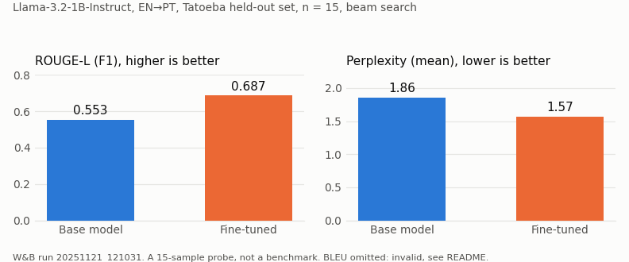

# lora_llama


_%7C_CUDA-1baf7a)

Built between September 2025 and July 2026 (first and last commit); frozen since.
This README is a record of what it was, what worked, and what was wrong. Nothing here
is being actively developed.

Two things live in this repo:

1. A LoRA fine-tune of **Llama-3.2-1B-Instruct** for English→Portuguese translation,
   trained on OpenSubtitles EN→PT on a MacBook (MPS), with a CUDA / Vast.ai path for
   larger runs.
2. An **LLM-as-a-judge** experiment: Qwen2.5-3B fine-tuned to score translation quality,
   with training data distilled from a larger Groq-hosted teacher. This part has a
   data-leakage flaw (described below) that makes its agreement numbers meaningless.

All configuration is in `params.py`.

## What worked



On a 15-sample Tatoeba EN→PT held-out set (beam search, adapter
`…opensubtitles-10ep…best_ep2`, W&B run `20251121_121031`), the fine-tuned adapter beat
the base model on the two metrics from this run that I trust:

| Model      | ROUGE-L (F1) | Perplexity (mean) | Quality-filter pass rate |
|------------|--------------|-------------------|--------------------------|
| Baseline   | 0.5528       | 1.86              | 86.7%                    |
| Fine-tuned | 0.6869       | 1.57              | 100.0%                   |
| Change     | +0.134       | −0.29             | +13.3 pts                |

The same run also logged BLEU (4.14 baseline, 23.36 fine-tuned). Those figures are
invalid because of a scoring bug and are deliberately left out of the table; see
"BLEU figures are invalid" below.

Fifteen samples is a probe, not a benchmark. The direction is consistent with the
examples further down, but I would not quote the size of the gap. The training budget
behind this adapter was also small (`DATASET_SAMPLES ≈ 200`, roughly 80 to 130 training
rows), and the test set is out of domain relative to the OpenSubtitles training data.

**Decoding sweep** for a different adapter (`20251118_131246_best_ep2`) on a different
test set (opus_books EN→PT, 127 samples, W&B run `20251119_131447`). Beam search won on
every metric. Because adapter and test set both differ, this table is not comparable to
the one above.

| Strategy    | ROUGE-L (F1) | Perplexity | Quality-filter pass rate |
|-------------|--------------|------------|--------------------------|
| greedy      | 0.5166       | 1.99       | 85.8%                    |
| beam search | 0.5954       | 1.70       | 94.5%                    |
| sampling    | 0.5103       | 1.85       | 85.8%                    |

The scripts that produced these are `compare_baseline_vs_finetuned.py` and
`compare_generation_strategies.py`. Every BLEU figure either script ever printed went
through the same scoring bug (`pt_app/trainer/evaluation.py`, lines 182 to 183 and 415),
so none is reported here.

## What was wrong

### BLEU figures are invalid (scoring bug)

`pt_app/trainer/evaluation.py:182-183` computes corpus BLEU like this:

```python
refs_formatted = [[ref] for ref in references]
bleu_score = sacrebleu.corpus_bleu(predictions, refs_formatted)
```

`sacrebleu.corpus_bleu` expects a list of reference *streams*: one list per reference
set, each aligned with `predictions`. For a single reference per sentence the correct
call is `corpus_bleu(predictions, [references])`. What the code passes instead is N
streams of length 1. sacrebleu zips hypotheses against the streams, which truncates to
the first hypothesis, and the N reference sentences are then treated as N alternative
references for that one hypothesis. So the reported "corpus BLEU" is the score of the
first test sentence, scored against every reference in the set. Checked with sacrebleu
2.5.1 (the pinned version): on a 3-sentence toy set the buggy call reports a system
length of one sentence and a score of 100, the correct call reports 47.9. The same
pattern is at line 415. The base-vs-fine-tuned BLEU delta of "4.14 → 23.36" that this
repo used to headline is therefore not a translation-quality result.

The fix is a one-line change. I have deliberately not applied it in this frozen repo,
so that the code matches the logged runs; the README carries the caveat instead.

### The judge's test set leaks its training sources

The judge training data is built by `pt_app/eval_model/judge_gen.py`: for each source
sentence, the teacher generates several Portuguese translations at controlled quality
levels, each with a 0 to 10 score, issues and feedback. `split_judge_data.py` then
shuffles those rows and cuts 80/10/10. Because the shuffle is at row level, the variants
of one source sentence land in train, val and test alike.

On the local split I trained and evaluated on (`datasets/judge_eval/`, not committed,
138 test rows): all 138 test rows have a source sentence that also appears in the
training set. The whole set of 1,372 rows covers only 124 distinct source sentences.
The judge therefore saw the source, the reference, and several scored translations of
every test item during training. The Cohen's κ / MAE / Pearson r that
`pt_app/eval_model/eval_judge_fast.py` computes against the teacher on that test set
measure memorisation of source-specific patterns, not judging ability, and I do not
report them here. (From my notes, not from a file in this repo: the agreement I measured
was at or below chance, which is consistent with a model that learned the sources rather
than the scoring.) A correct split would group by source sentence before splitting, and
hold out sources the judge has never seen.

## Examples

Base Llama-3.2-1B vs. the fine-tuned model on the same inputs (from the Tatoeba
baseline-vs-fine-tuned run above). The base model often picks a wrong sense or appends
an explanatory note; the fine-tuned model is concise and idiomatic:

| English | Base model | Fine-tuned | Reference |
|---------|------------|-----------|-----------|
| This vacuum cleaner is noisy. | Esta máquina de limpeza de **pólvora** é ruim. | A máquina de limpeza é **barulhosa**. | Este aspirador de pó é barulhento. |
| Tom sings in the school chorus. | Tom canta na coralagem escolar. *Nota: "chorus"...* | O Tom cantava no coro da escola. | Tom canta no coral da escola. |
| Let's play some video games to kill time. | Vamos jogar alguns jogos de vídeo... *Essa tradução mantém...* | Vamos jogar videogames para passar o tempo. | Vamos jogar video game para matar o tempo. |
| We've got to find Tom first. | Temos que encontrar Tom primeiro. | Temos de encontrar **o** Tom primeiro. | Temos que encontrar o Tom primeiro. |

The base model's appended notes and verbosity are what the quality filter
(`pt_app/trainer/quality_filter.py`) is there to catch: it filters or rejects such verbose
or mixed-language outputs before scoring (language, length and repetition checks), and it
is why the base model's filter pass rate is 86.7% against the fine-tuned model's 100%.

## Layout

| Path | What |
|------|------|
| `params.py` | Config: model, LoRA, optimizer, generation strategies |
| `train.py` | Entry point: build data, sanity-check, train, evaluate |
| `pt_app/data/` | Dataset loading, preprocessing, chat-template formatting |
| `pt_app/trainer/` | LoRA training loop (`trainer_pt.py`), evaluation (`evaluation.py`, contains the BLEU bug), quality filter, stopping criteria |
| `pt_app/eval_model/` | Judge model: data gen, training (`_mps` local / `_cuda` cloud), eval |
| `run_inference.py` | CLI to translate with a trained adapter |
| `compare_baseline_vs_finetuned.py` | Base vs. fine-tuned comparison |
| `compare_generation_strategies.py` | greedy / beam / sampling sweep |
| `split_judge_data.py`, `check_data_overlap.py` | Judge data split (row-level, the source of the leakage) and a file-consistency check |
| `docs/` | Detailed guides (training, inference, MPS vs CUDA, Vast.ai setup) |

## Usage

```bash
pip install -r requirements.txt          # add requirements_cuda.txt on NVIDIA GPUs
cp .env.example .env                      # then fill in your tokens

# Train the translation adapter (config in params.py)
python train.py

# Translate with a trained adapter
python run_inference.py --adapter ./adapters/<run_name> --interactive
python run_inference.py --adapter ./adapters/<run_name> --prompt "Hello, how are you?"

# Compare base vs. fine-tuned
python compare_baseline_vs_finetuned.py --adapter ./adapters/<run_name>
```

## Training setup

| | Translation model | Judge model |
|--|--|--|
| Base | Llama-3.2-1B-Instruct | Qwen2.5-3B-Instruct |
| Method | LoRA (r=16, ~3.4M trainable params, 0.28%) | LoRA + 4-bit quantization |
| Data | OpenSubtitles EN→PT | Groq-generated quality-scored translations |
| Hardware | MacBook Pro, Apple Silicon (MPS) | Cloud NVIDIA GPU (Vast.ai / CUDA) |
| Run | ~2h16m, 10-epoch config, early-stopped (best at epoch 2) | 3 epochs |

The translation model is small enough to fine-tune locally in a couple of hours; the 3B
judge needs a GPU, hence the CUDA path and the Vast.ai upload/download tooling
(`upload_to_vm.sh`, `setup_vast.sh`). A Llama-3.2-**3B** translation model was also
tried, but 1B was kept as the final generator. The results tables draw on the better
tracked runs; earlier experiments ranged from a few minutes to ~7 hours. The committed
`params.py` ships a fast-start default (`EPOCHS=1`, `DATASET_SAMPLES=200`); the tracked
results above came from a longer 10-epoch run (early-stopped at epoch 2) over the same
~200-sample data budget.

## Judge model (LLM-as-a-judge, distilled from a teacher)

The idea: rather than relying only on BLEU/ROUGE, fine-tune a small model (Qwen2.5-3B) to
score translation quality the way a much larger model does. A Groq-hosted teacher takes
each source/reference pair and generates several Portuguese translations at controlled
quality levels, each labelled with a score, the specific issues, and feedback
(`pt_app/eval_model/judge_gen.py`). The student learns to reproduce those scores;
`pt_app/eval_model/eval_judge_fast.py` measures agreement with the teacher via Cohen's κ,
MAE and Pearson r.

As built, the experiment does not support any conclusion about whether the distillation
worked, because the test set shares every source sentence with the training set (see
"The judge's test set leaks its training sources" above). The pipeline itself, data
generation, splitting, LoRA training with 4-bit quantization on a rented GPU, and
evaluation, runs end to end; the number it produces at the end is not a measurement of
judging ability.

The 3B judge is trained via the cloud NVIDIA GPU path (`judge_train_cuda.py`, default
`Qwen/Qwen2.5-3B-Instruct`). A smaller local variant runs on Apple Silicon
(`judge_train_mps.py`, default `Qwen/Qwen2-1.5B-Instruct`). See
[`docs/JUDGE_TRAINING_USAGE.md`](docs/JUDGE_TRAINING_USAGE.md)
and [`docs/VAST_AI_SETUP.md`](docs/VAST_AI_SETUP.md).

## If I picked it up again

- Fix the BLEU call (`[references]` instead of `[[r] for r in references]`) and re-score
  the saved predictions.
- Split the judge data by source sentence, not by row, and hold out sources.
- Evaluate on hundreds of in-domain samples, not 15, with bootstrap intervals.
- One canonical adapter and one held-out split for both the baseline comparison and the
  decoding sweep, so the two tables become comparable.

## Notes

- Requires a Hugging Face token with access to the Llama-3.2 and Qwen models.
- `adapters/`, `outputs/`, `datasets/`, and `wandb/` are gitignored; weights, data and
  run logs stay local. The numbers above are read from the local W&B run directories
  named in the text.
- Experiment tracking via Weights & Biases / Weave (toggle `USE_WANDB` in `params.py`).
- Fully pinned environment in `requirements-lock.txt`.

---

<sub>Original code written by me; documentation and repo cleanup done with the help of [Claude Code](https://claude.com/claude-code).</sub>
